# Variabilidad de la Frecuencia Cardíaca (HRV) y balance autonómico 

## Asignatura

Procesamiento Digital de Señales

## Programa

Ingeniería Biomédica – Universidad Militar Nueva Granada

## Práctica de laboratorio

**Variabilidad de la Frecuencia Cardíaca (HRV) y balance autonómico**

## Integrantes

Danna Jimena Medina Ríos – Código 5600923
María José Polo Tovar – Código 5600894

---
## Descripción
Este repositorio contiene el desarrollo de una práctica de laboratorio enfocada en el análisis de señales electrocardiográficas (ECG) y variabilidad de la frecuencia cardíaca (HRV). El objetivo principal fue evaluar cambios en la actividad cardíaca mediante el análisis temporal y no lineal de la señal ECG en dos segmentos del registro.

La señal ECG fue cargada desde un archivo de texto y procesada en Python. Inicialmente, se aplicó un filtro de Kalman para reducir el ruido y mejorar la calidad de la señal. Posteriormente, la señal filtrada se dividió en dos segmentos temporales: de 0 a 2 minutos y desde los 2 minutos hasta el final del registro.

En cada segmento se realizó la detección automática de picos R para calcular los intervalos R-R y construir las señales HRV. Luego, se calcularon parámetros en el dominio del tiempo, como la media RR, la desviación estándar y la frecuencia cardíaca promedio. Además, se realizó un análisis no lineal mediante diagramas de Poincaré, obteniendo índices SD1, SD2, CSI y CVI.

Finalmente, los resultados fueron representados gráficamente para comparar el comportamiento cardíaco y la variabilidad autonómica entre ambos segmentos analizados.

---
##  Metodología 

El desarrollo del análisis se estructuró en varias etapas principales, utilizando herramientas de programación en Python para el procesamiento y análisis de señales electrocardiográficas (ECG) y de variabilidad de la frecuencia cardíaca (HRV).

En primer lugar, se realizó la carga del archivo de texto que contenía la señal ECG. A partir del encabezado del archivo, se extrajo automáticamente la frecuencia de muestreo mediante expresiones regulares, lo que permitió construir correctamente el vector de tiempo asociado a la señal. Posteriormente, se cargaron los datos utilizando la librería pandas y se obtuvo la señal ECG correspondiente. Finalmente, se realizó una gráfica de la señal original para visualizar su comportamiento inicial.

En una segunda etapa, se implementó un filtro de Kalman con el propósito de reducir el ruido presente en la señal. Para ello, se calcularon parámetros iniciales como la media y la desviación estándar de los primeros 50 ms de la señal, utilizados para estimar las covarianzas del filtro. Posteriormente, se ejecutaron las etapas de predicción y corrección del algoritmo de Kalman de forma iterativa, obteniendo una señal ECG filtrada. Luego, se compararon gráficamente la señal original y la señal filtrada para verificar la mejora en la calidad de la señal.

Posteriormente, la señal filtrada fue dividida en dos segmentos temporales: el primero comprendido entre 0 y 2 minutos, y el segundo desde los 2 minutos hasta el final del registro. Cada segmento fue representado gráficamente para facilitar su análisis independiente.

En la siguiente etapa, se realizó la detección de picos R utilizando la función find_peaks de la librería scipy.signal. Para cada segmento se establecieron parámetros de distancia mínima, altura y prominencia, permitiendo identificar adecuadamente los complejos R del ECG. Los picos detectados fueron visualizados sobre las señales correspondientes mediante gráficas.

A partir de los picos R detectados, se calcularon los intervalos R-R mediante la diferencia temporal entre picos consecutivos. Con estos intervalos se construyeron las señales de variabilidad de la frecuencia cardíaca (HRV) para ambos segmentos, las cuales fueron representadas gráficamente para observar las variaciones temporales de la actividad cardíaca.

Finalmente, se calcularon parámetros de HRV en el dominio del tiempo, incluyendo la media de los intervalos R-R, la desviación estándar y la frecuencia cardíaca promedio. Adicionalmente, se realizó un análisis no lineal mediante diagramas de Poincaré, donde se graficaron los intervalos RR(n) frente a RR(n+1). A partir de estos diagramas se obtuvieron los índices SD1 y SD2, relacionados con la variabilidad de corto y largo plazo, así como los índices CSI y CVI, asociados a la actividad simpática y vagal del sistema nervioso autónomo.

En conjunto, este procedimiento permitió analizar el comportamiento temporal y no lineal de la señal ECG y de la HRV, facilitando la evaluación de cambios en la regulación autonómica cardíaca entre los diferentes segmentos estudiados.

---
## Diagrama de Flujo
  <p align="center">
  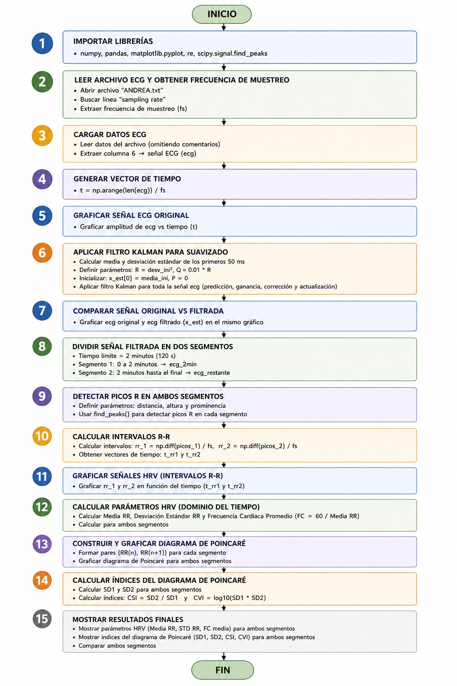
</p>

<p align="center">
  <em> Plan de acción diagrama de flujo </em>
</p>

---
### Parte A — Fundamento teórico

## 1. Sistema nervioso autónomo (simpático y parasimpático)
El sistema nervioso autónomo (SNA) regula funciones involuntarias del cuerpo, incluyendo la actividad cardíaca. Se divide en:

## 1.1 Sistema simpático 
- Se activa en situaciones de estrés o actividad (“lucha o huida”).
- Efectos en el corazón:
Aumenta la frecuencia cardíaca (taquicardia), incrementa la fuerza de contracción, reduce la variabilidad de la frecuencia cardíaca (HRV).
## 1.2 Sistema parasimpático
- Predomina en estados de reposo (“reposo y digestión”).
- Actúa principalmente a través del nervio vago.
- Efectos en el corazón: Disminuye la frecuencia cardíaca, aumenta la variabilidad cardíaca (HRV).

El equilibrio entre ambos sistemas regula el ritmo cardíaco.

---

## 2. Efecto de la respiración sobre la actividad cardíaca
La respiración influye directamente en la frecuencia cardíaca mediante un fenómeno llamado:

## 2.1 Arritmia sinusal respiratoria
- Durante la **inspiración**:
  
  → Disminuye la actividad parasimpática.
  
  → Aumenta la frecuencia cardíaca.
- Durante la **espiración**:
  
  → Aumenta la actividad parasimpática.
  
  → Disminuye la frecuencia cardíaca.

Esto genera variaciones en los intervalos R-R del ECG.

---

## 3. Variabilidad de la Frecuencia Cardíaca (HRV)
La HRV (Heart Rate Variability) es la variación en el tiempo entre latidos consecutivos del corazón.

- Cómo se obtiene
1. Se registra la señal de ECG.
2. Se identifican los picos R.
3. Se calcula el tiempo entre picos consecutivos:
   
   $$
RR_i = t_{i+1} - t_i
$$

- Importancia
  
Indicador del estado del sistema nervioso autónomo.

Alta HRV → buena adaptación fisiológica.

Baja HRV → estrés, fatiga o posibles patologías

---
## 4. Diagrama de Poincaré

Es una herramienta gráfica para analizar la serie de intervalos R-R.

- Cómo se construye
  
Se grafica:

$$
RR_{n+1} \text{ vs } RR_n
$$

- Interpretación
  
Forma de nube elíptica:

Ancha → alta variabilidad (parasimpático dominante)

Estrecha → baja variabilidad (simpático dominante)

- Parámetros importantes
  
   → SD1: eje corto de la elipse: variabilidad a corto plazo (latido a latido), refleja actividad parasimpática.
  
   → SD2: eje largo: variabilidad a largo plazo, refleja actividad simpática + parasimpática.
  
  ---
  ## 5. Plan de acción
  
  <p align="center">
  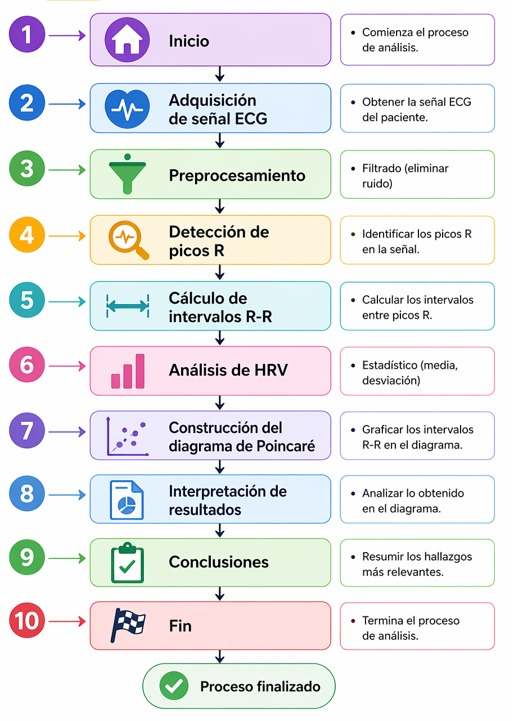
</p>

<p align="center">
  <em> Plan de acción diagrama de flujo </em>
</p>

---
### Parte A - Adquisición de la señal ECG 
  <p align="center">
  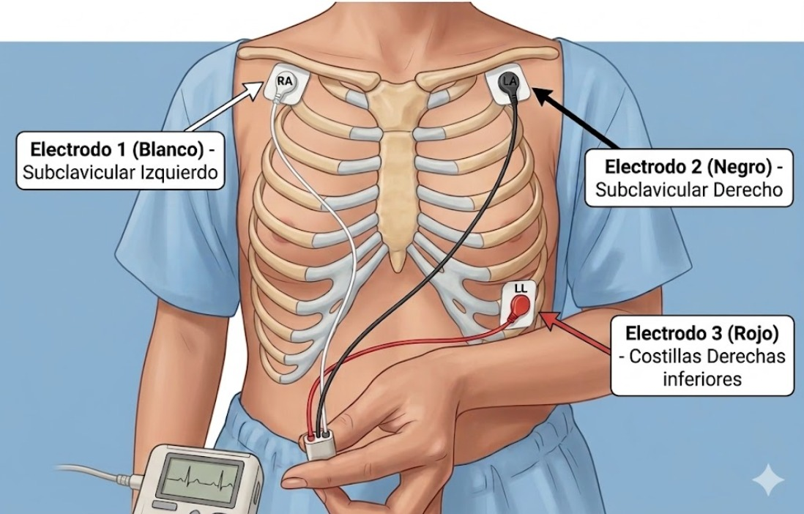
</p>

<p align="center">
  <em> Esquema colocación de electrodos </em>
</p>

Se selecciona una mujer de 19 años como sujeto de prueba para adquirir la señal electrocardiográfica. La señal ECG se graba durante 4 minutos, de los cuales la participante permanece inmóvil y en silencio total durante los 2 primeros minutos; posteriormente, lee en voz alta un pasaje de un texto seleccionado por el equipo durante los 2 últimos minutos.

La toma de la señal electrocardiográfica se realiza mediante un BITalino y la correcta conexión de los cables. El electrodo con cable de color blanco se ubica en la región subclavicular izquierda, el electrodo con cable de color negro en la región subclavicular derecha y, por último, el electrodo con cable de color rojo en las costillas derechas.

  <p align="center">
  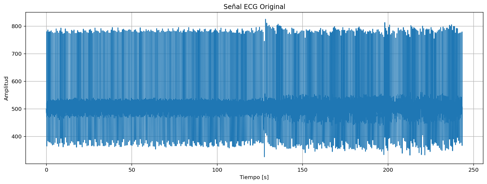
</p>

<p align="center">
  <em> Señal Original </em>
</p>

Para que la frecuencia de muestreo y los niveles de cuantificación fueran apropiados para el tipo de señal se realizo una frecuencia de muestreo de 1000 Hz.

---

### Parte B - Pre-procesamiento de la señal

<p align="center">
  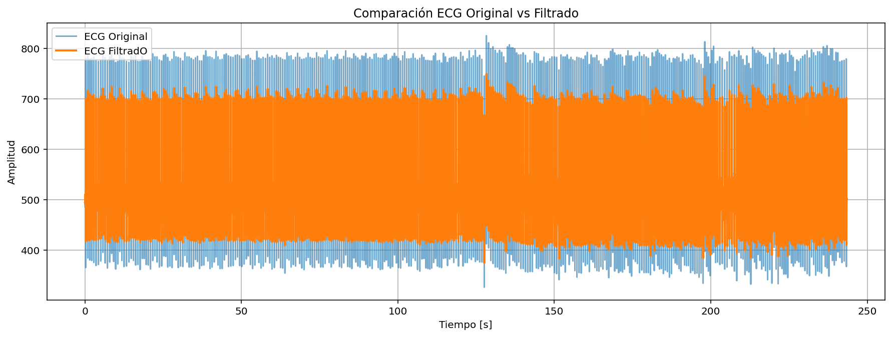
</p>

<p align="center">
  <em> Señal Original y Filtrada </em>
</p>

---

```python
tiempo_limite = 2 * 60        # 120 segundos
indice_2min = int(tiempo_limite * fs)

ecg_2min    = x_est[:indice_2min]   # Segmento 1: 0–120 s
t_2min      = t[:indice_2min]

ecg_restante = x_est[indice_2min:]  # Segmento 2: 120 s – final
t_restante   = t[indice_2min:]
```
<p align="center">
  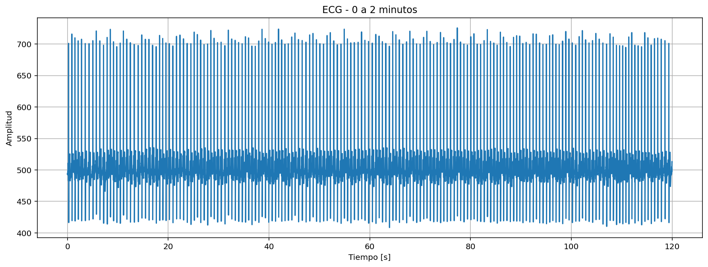
</p>

<p align="center">
  <em> Segmento 1 </em>
</p>

El segmento 1 (0–120 s) muestra picos muy uniformes a ~700 unidades porque el sujeto estaba en reposo estable. El filtro Kalman ya eliminó el ruido de línea base.

<p align="center">
  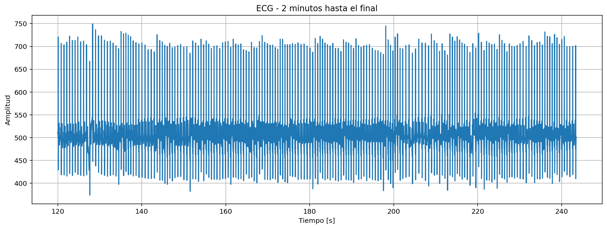
</p>

<p align="center">
  <em> Segmento 2 </em>
</p>

El segmento 2 (120–245 s) tiene mayor variabilidad en amplitud y algunos picos anómalos visibles, lo que sugiere movimiento o cambio fisiológico durante esa parte del registro.

---

```python
# Distancia mínima entre picos: 400 ms (frecuencia cardíaca máx. ~150 bpm)
distancia = int(0.4 * fs)

# Umbrales calculados a partir de cada segmento por separado
altura1 = np.mean(ecg_2min) + 0.3 * np.std(ecg_2min)
prom1   = 0.2 * np.std(ecg_2min)

picos_1, _ = find_peaks(
    ecg_2min,
    distance=distancia,
    prominence=prom1,
    height=altura1
)
```
<p align="center">
  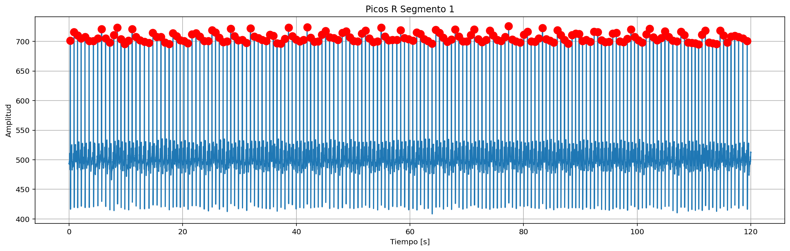
</p>

<p align="center">
  <em> Segmento 1 Picos R-R </em>
</p>

Los puntos rojos funcionan bien en el segmento 1, debido a que la señal es muy regular (baja varianza), entonces el umbral media + 0.3·std queda justo debajo de todos los picos R reales y por encima de todo el ruido. Los puntos rojos caen perfectamente sobre cada onda R.

<p align="center">
  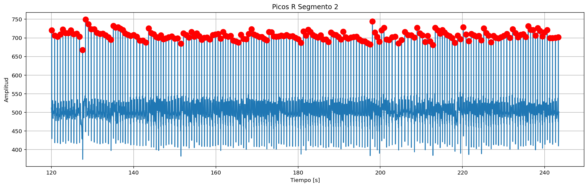
</p>

<p align="center">
  <em> Segmento 2 Picos R-R </em>
</p>

En el segmento 2 hay algunas detecciones imperfectas debido a que al haber artefactos (picos anómalos de mayor amplitud), la media y la std del segmento se elevan ligeramente, subiendo el umbral. Algunos picos R reales quedan justo en el límite, y los artefactos generan detecciones adicionales o desplazadas.

---

```python
# np.diff calcula la diferencia entre índices consecutivos de picos
rr_1 = np.diff(picos_1) / fs   # → en segundos
rr_2 = np.diff(picos_2) / fs

# El tiempo de cada intervalo es el instante del segundo pico
t_rr1 = t_2min[picos_1[1:]]
t_rr2 = t_restante[picos_2[1:]]

plt.plot(t_rr1, rr_1, marker='o')
plt.plot(t_rr2, rr_2, marker='o')
```
<p align="center">
  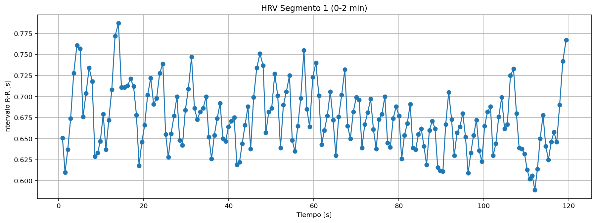
</p>

<p align="center">
  <em> Segmento 1 Nueva Señal </em>
</p>

Intervalos R-R oscilan entre 0.60 y 0.78 s de forma ordenada y ondulante. Esa variación rítmica corresponde a la arritmia sinusal respiratoria (RSA): el intervalo se alarga al inspirar y se acorta al espirar. FC media ≈ 80–90 bpm.

<p align="center">
  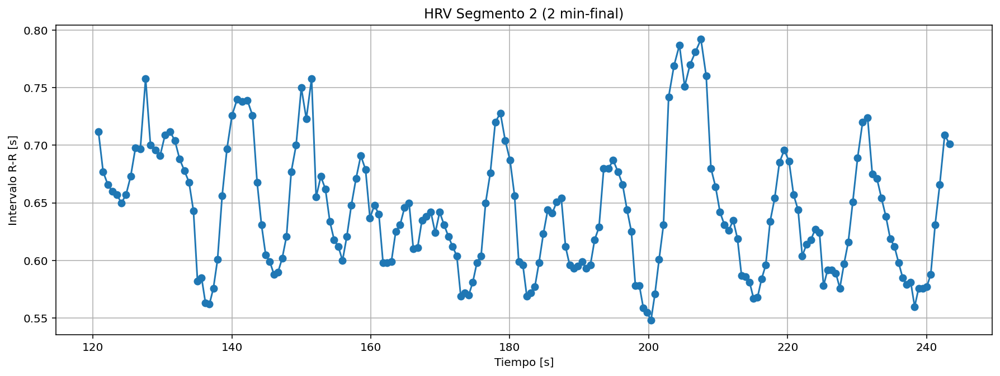
</p>

<p align="center">
  <em> Segmento 2 Nueva Señal </em>
</p>

Rango más amplio (0.55–0.80 s) con fluctuaciones más bruscas e irregulares. Indica mayor actividad del sistema nervioso autónomo y posiblemente la influencia de artefactos en la detección de picos.

----
### Parte B - Análisis de la HRV en el dominio del tiempo 

```python
# PARÁMETROS HRV EN DOMINIO DEL TIEMPO

# Media de los intervalos R-R
media_rr1 = np.mean(rr_1)      # → 0.6730 s
media_rr2 = np.mean(rr_2)      # → 0.6418 s

# Desviación estándar de los intervalos R-R
std_rr1 = np.std(rr_1)        # → 0.0382 s
std_rr2 = np.std(rr_2)        # → 0.0546 s

# Frecuencia cardíaca media = 60 / media_RR
fc1 = 60 / media_rr1           # → 89.15 bpm
fc2 = 60 / media_rr2           # → 93.48 bpm
```

<p align="center">
  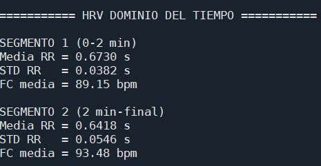
</p>
<p align="center">
  <em> Datos HRV </em>
</p>

La comparación entre segmentos muestra un incremento de la frecuencia cardíaca de aproximadamente 4.3 bpm y una mayor variabilidad aparente en el segmento 2. El segmento 1 refleja un estado fisiológico más estable y sus parámetros son más representativos del estado basal del sujeto. El aumento de la STD R-R en el segmento 2 debe considerarse parcialmente artefactual. En conjunto, los datos sugieren que hubo un cambio en las condiciones del sujeto a partir del minuto 2 del registro, posiblemente asociado a movimiento o cambio postural, lo cual se manifiesta tanto en la aceleración de la frecuencia cardíaca como en la mayor irregularidad de los intervalos R-R observada en la señal HRV.

----
### Parte C - Construcción del diagrama de Poincaré 

El diagrama de Poincaré es una herramienta de análisis no lineal de la HRV que consiste en graficar cada intervalo R-R contra el intervalo R-R inmediatamente siguiente, es decir, se representa el par (RR(n), RR(n+1)) como un punto en un plano cartesiano. La nube de puntos resultante adopta una forma elíptica característica cuya dispersión contiene información sobre la dinámica del sistema cardiovascular. Para construirlo, el código toma los arreglos de intervalos R-R de cada segmento y los desplaza en una posición:

```python
# Segmento 1
rr1_x = rr_1[:-1]   # RR(n)
rr1_y = rr_1[1:]    # RR(n+1)

# Segmento 2
rr2_x = rr_2[:-1]
rr2_y = rr_2[1:]
```
De esta manera, cada punto del diagrama representa la transición de un latido al siguiente, y la forma de la nube revela si esas transiciones son regulares o caóticas.

<p align="center">
  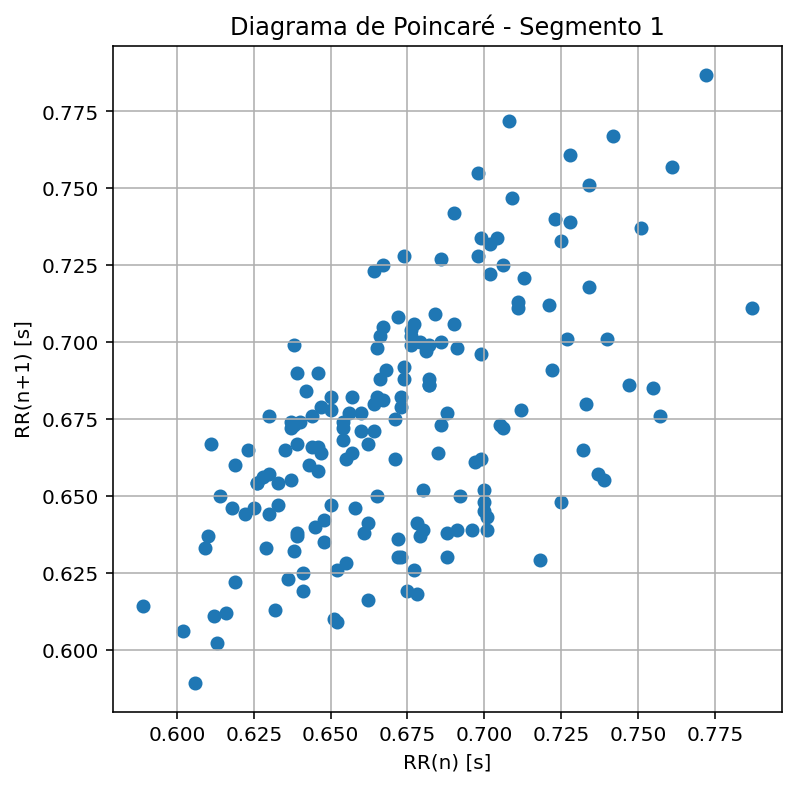
</p>
<p align="center">
  <em> Segmento 1 Diagrama Poincaré  </em>
</p>

En el segmento 1, la nube de puntos se distribuye de forma relativamente compacta y alargada a lo largo de la diagonal principal del plano, con los puntos concentrados en torno a los valores 0.650–0.720 s en ambos ejes. La dispersión es moderada y la forma elíptica es clara, lo que indica que los intervalos R-R consecutivos tienen una correlación positiva fuerte: cuando un latido es largo, el siguiente también tiende a serlo, y viceversa. Este patrón es típico de la arritmia sinusal respiratoria en un estado fisiológico estable.

<p align="center">
  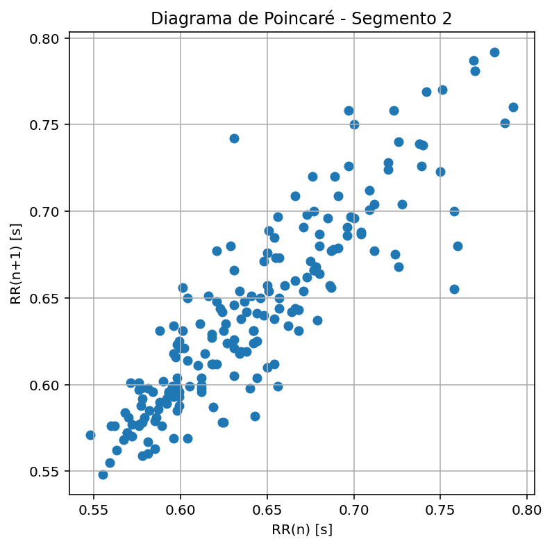
</p>
<p align="center">
  <em> Segmento 1 Diagrama Poincaré </em>
</p>

En el segmento 2, la nube de puntos se extiende sobre un rango más amplio, aproximadamente de 0.55 s a 0.80 s en ambos ejes, y su dispersión transversal es mayor que en el segmento 1. Esto indica una variabilidad latido a latido más elevada e irregular, coherente con el aumento de STD R-R observado en el dominio del tiempo. La mayor dispersión también refleja la influencia de artefactos de movimiento en ese segmento, que introducen puntos alejados del patrón central de la nube.

---
A partir de los diagramas de Poincaré se calcularon cuatro índices cuantitativos. SD1 y SD2 se obtienen como la desviación estándar de las proyecciones de los puntos sobre los ejes perpendicular y paralelo a la diagonal de identidad, respectivamente:

```python
# Segmento 1
sd1_1 = np.std((rr1_y - rr1_x) / np.sqrt(2))   # dispersión transversal
sd2_1 = np.std((rr1_y + rr1_x) / np.sqrt(2))   # dispersión longitudinal

# Segmento 2
sd1_2 = np.std((rr2_y - rr2_x) / np.sqrt(2))
sd2_2 = np.std((rr2_y + rr2_x) / np.sqrt(2))
```
SD1 refleja la variabilidad a corto plazo, latido a latido, asociada principalmente a la actividad del sistema nervioso parasimpático. SD2 refleja la variabilidad a largo plazo, asociada tanto al sistema simpático como al parasimpático. A partir de SD1 y SD2 se calculan los índices CSI y CVI:
```python
CSI = sd2 / sd1          # Cardiac Sympathetic Index
CVI = log10(sd1 * sd2)   # Cardiac Vagal Index
```
<p align="center">
  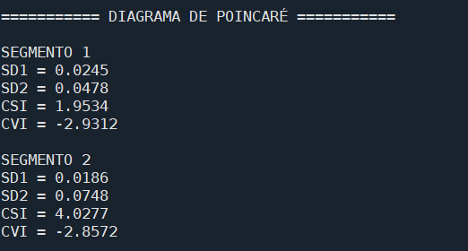
</p>
<p align="center">
  <em> Datos Poincaré </em>
</p>

El análisis del diagrama de Poincaré y sus índices derivados permite concluir que durante el segmento 2 del registro hubo un desplazamiento del balance autonómico hacia una mayor predominancia simpática, evidenciado por el aumento del CSI de 1.9534 a 4.0277 y la reducción de SD1 de 0.0245 a 0.0186. El segmento 1 refleja un estado de mayor equilibrio entre las ramas simpática y parasimpática del sistema nervioso autónomo, con una variabilidad a corto plazo más elevada y un índice simpático menor. El CVI prácticamente estable entre ambos segmentos indica que el tono vagal basal del sujeto no experimentó cambios importantes a lo largo del registro.

---
### Conclusiones

El análisis de la señal ECG de la sujeto permitió identificar dos estados fisiológicos diferenciados a lo largo del registro. Durante los primeros dos minutos, la señal filtrada mostró un comportamiento estable y uniforme, con picos R bien definidos y una frecuencia cardíaca media de 89.15 bpm, una STD R-R de 0.0382 s y un índice de actividad simpática CSI de 1.9534, valores que en conjunto reflejan un estado cardiovascular relativamente equilibrado con participación activa del sistema parasimpático. A partir del minuto 2, se evidenció un cambio fisiológico claro: la frecuencia cardíaca se incrementó a 93.48 bpm, la media R-R disminuyó de 0.6730 s a 0.6418 s, y el CSI casi se duplicó hasta alcanzar un valor de 4.0277, lo que indica un desplazamiento del balance autonómico hacia una mayor predominancia simpática, posiblemente asociada a movimiento o cambio postural del sujeto durante el registro. La STD R-R del segmento 2 fue de 0.0546 s, un 43 % mayor que la del segmento 1, aunque este valor debe interpretarse con cautela dado que los artefactos de movimiento presentes en ese segmento afectaron la detección de picos R e introdujeron intervalos R-R anómalos que inflaron artificialmente la desviación estándar. El CVI se mantuvo prácticamente constante entre ambos segmentos, con valores de 2.9312 y 2.8572, lo que sugiere que el tono vagal basal del sujeto no experimentó variaciones significativas a lo largo del registro.

---
### Bibliografía


